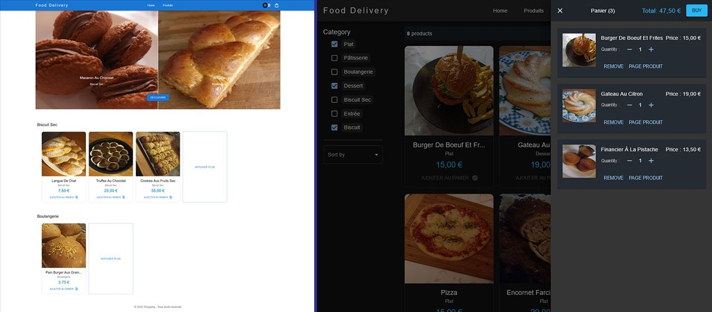

# Foodeliveries

A front-end food delivery app, built with JavaScript, Vitejs, React, TypeScript, React Router, Material UI, Vitest and React Testing Library

## Demo Link

Access to site demo at [foodeliveries.netlify.app](https://foodeliveries.netlify.app/)

## Screenshot

## Installation and Setup Instructions

Clone down this repository. You will need `node` and `npm` installed globally on your machine.

Installation:

`npm install`

To Run Test Suite:

`npm run test`

To Run Coverage Test Suite:

`npm run test:coverage`

To Start Development Server:

`npm run dev`

To Build project:

`npm run build`
